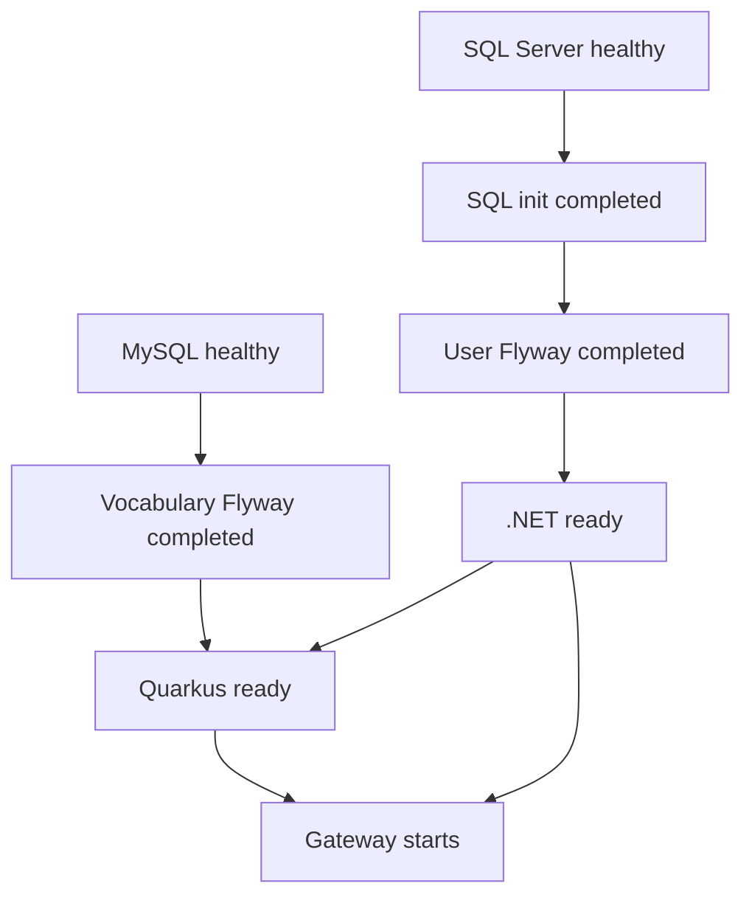

# Japanese Learning backend stack

Prerequisites: Docker with Linux containers and Docker Compose v2 or newer,
plus initialized Git submodules (`git submodule update --init --recursive`).
Application SDKs are not needed to build the images.

1. Copy `.env.example` to `.env` and set all three database passwords.
   Keep existing passwords when reusing database volumes; changing `.env`
   does not change stored database credentials. Follow the quoting notes in
   `.env.example`.
2. Provide a matching RSA PEM pair (at least 2048 bits, unencrypted private key):
   `secrets/jwt/private.pem` and `secrets/jwt/public.pem`.
   Alternatively run `pwsh -File ./scripts/generate-jwt-keys.ps1` (requires
   PowerShell and the .NET 9 SDK; refuses to overwrite existing keys).
   Both files must be readable by the .NET container user, UID 1654, with
   directory traversal permission. They are mounted read-only only into .NET.
   `.env` and `secrets/` are gitignored. Restart .NET after replacing keys.
3. Start from this directory:

   ```sh
   docker compose up --build
   ```

   Use `docker compose up --build -d` for detached mode, `docker compose ps -a`
   for status, and `docker compose logs user-api vocabulary-api` for app logs.

| Service | Host address | Container address |
| --- | --- | --- |
| MySQL (vocabulary only) | localhost:3306 | mysql:3306 |
| SQL Server (users only) | localhost:1433 | sqlserver:1433 |
| .NET User/Auth | http://localhost:8081 | http://user-api:8080 |
| Quarkus Vocabulary/Flashcard | http://localhost:8082 | http://vocabulary-api:8080 |

Readiness and public keys:

- .NET liveness: http://localhost:8081/health/live
- .NET SQL-backed readiness: http://localhost:8081/health/ready (`/health` remains an alias)
- Public JWKS: http://localhost:8081/.well-known/jwks.json
- Quarkus health: http://localhost:8082/q/health
- Quarkus liveness: http://localhost:8082/q/health/live
- Quarkus readiness: http://localhost:8082/q/health/ready

Database healthchecks execute authenticated SQL queries. MySQL must be healthy
before vocabulary Flyway runs. SQL Server must be healthy before the idempotent
`sqlserver-init` creates `JapaneseLearningUser` if absent, then user Flyway runs.
Each application waits for its database healthcheck and successful Flyway exit.
Flyway and the database initializer are one-shot containers with no automatic
restart; an exit code of 0 is expected. Migration failures block application startup.

Quarkus starts after .NET readiness passes and retains its 60-second initial
JWKS retry window. Both application Docker healthchecks use their readiness
endpoints through curl and discard response bodies. .NET installs curl in its
runtime image; Quarkus uses the runtime's existing curl.
Both applications retain their Dockerfile non-root users and share the default
Compose network. Quarkus obtains public keys only from
`http://user-api:8080/.well-known/jwks.json`. JWT issuer/audience values in `.env`
configure both services consistently. Authentication and role restrictions remain
enabled. Angular is not part of this stack.

Health and failure behavior:

- .NET `/health/live` performs no dependency I/O. `/health/ready` and `/health`
  open the configured application database connection, with a three-second check
  timeout. Responses contain only `Healthy` or `Unhealthy` (200 or 503).
  Required options and RSA keys must pass startup validation before HTTP serves.
- Quarkus `/q/health/live` is independent of MySQL and JWKS. `/q/health/ready`
  uses the built-in reactive MySQL check; `/q/health` aggregates checks and must
  not be used as liveness. Health JSON exposes only status and check names.
- JWKS is fetched at Quarkus initialization and cached. No health request calls
  Auth. During an Auth outage, valid tokens using cached keys can still work;
  unknown keys requiring refresh cannot be verified while JWKS is unavailable.
- SQL/MySQL outages fail the respective readiness probe while application
  liveness remains healthy. Recovery is detected by subsequent probes.
- Compose gates initial startup on health and successful one-shot completion.
  It does not continuously gate traffic or stop dependents after an outage.
  `restart: unless-stopped` restarts exited processes, not unhealthy containers.
  Application probes retain 12 consecutive failures before Docker marks them
  unhealthy. Endpoint readiness can fail earlier. Curl stops waiting after five
  seconds; the built-in Quarkus datasource check can take up to 20 seconds during
  connection failure. These probe deadlines do not change application liveness.
- NGINX stays alive during backend outages; affected proxied requests can return
  502 (connection failure) or 504 (timeout). It does not aggregate backend health.
- Readiness checks connectivity, not migration history or every business query.
  Successful Flyway completion is the schema readiness gate. When manually
  running applications outside Compose, apply migrations first.

Startup dependencies (arrows mean the preceding condition must pass):



Quarkus requires both vocabulary Flyway completion and .NET readiness. Gateway
requires both backend readiness checks. Init/Flyway jobs have `restart: "no"`
and no healthcheck; failed jobs block new dependent application startup.

For safe fresh-volume checks, use a separate Compose project **and** override
fixed `container_name` entries and host ports. A project name alone is insufficient
because this file has fixed DB/Flyway names. Keep its volumes separate from normal
`mysql_data` and `sqlserver_data`; stop dependencies only in the disposable project.
Never print resolved Compose configuration containing passwords: use
`docker compose config --quiet` for validation.

Stop containers with `docker compose stop`, or remove containers and the network
with `docker compose down`. Database named volumes survive both operations.
`docker compose down -v` deletes those volumes and their database contents;
do not use it unless intentionally resetting all local data.

---

## API Gateway

NGINX (official `nginx:stable-alpine`) is the client-facing backend entry point:
**http://localhost:8080** (host 8080 to container 80). Start it with the same
`docker compose up --build -d` command. Direct ports 8081/8082 remain available
for backend debugging; clients should use the Gateway.

| Gateway path | Owner / internal upstream |
| --- | --- |
| `/api/auth` and descendants | .NET, `user-api:8080` |
| `/api/v1/flashcards` and descendants | Quarkus, `vocabulary-api:8080` |
| `/api/v1/jlpt-levels` and descendants | Quarkus, `vocabulary-api:8080` |
| `/api/v1/lessons` and descendants | Quarkus, `vocabulary-api:8080` |
| `/api/vocabularies` and descendants (including import) | Quarkus, `vocabulary-api:8080` |
| `/health` | Static Gateway process health (200) |
| Other paths | 404 |

Paths, query parameters, and Authorization are preserved. NGINX forwards Host,
X-Real-IP, X-Forwarded-For, and X-Forwarded-Proto; as the edge proxy it replaces
client-supplied forwarding headers. Backends retain their current proxy-trust
settings. Uploads are capped at 10 MiB. Standard stdout/stderr logging is used;
access logs omit query strings, request bodies, and credential headers.

.NET still issues and validates JWTs; Quarkus still validates RS256 and enforces
User/Admin access and Admin-only import. NGINX performs no JWT or role checks
and mounts no RSA keys. Quarkus continues to fetch JWKS directly from
`http://user-api:8080/.well-known/jwks.json`. Current clients do not need public
JWKS through the Gateway, so that path returns 404 there; the existing .NET
debug port still exposes public JWKS.

Gateway startup waits for both .NET and Quarkus readiness. Gateway `/health`
only proves NGINX can serve HTTP; it does not prove whole-system readiness.
Use the direct health URLs above to diagnose backends.
Docker DNS refresh handles upstream container IP changes without an NGINX restart.
Check configuration with `docker compose exec gateway nginx -t`.

Neither backend currently configures CORS. Step 6 leaves CORS unchanged.
For Step 7, prefer same-origin frontend/API hosting; if Angular runs on another
origin, configure an explicit origin allowlist and preflight handling once at
the Gateway, without duplicating policies in the services. Angular is unchanged.

## Logging and correlation IDs (Step 8.2)

NGINX and both services preserve a single `X-Correlation-ID` containing 1?64
ASCII letters, digits, underscores, or hyphens. Missing, empty, invalid,
overlong, and duplicate values are replaced with a random 32-character hex ID.
The gateway forwards its selected ID and returns exactly one response header,
including on error responses. Direct backend requests follow the same rules.
Angular needs no change: requests without a header receive a generated ID.

.NET uses the ID as its existing `traceId` and includes `CorrelationId` in JSON
console logging scopes. Quarkus keeps its existing `meta.traceId` and
`meta.correlationId` contract; `X-Trace-Id` is also validated. Its HTTP filter
runs before authentication and uses Quarkus reactive MDC for application logs.
Request completion logs contain status, duration, and correlation context;
application error logs use exception types instead of potentially sensitive
exception messages. The .NET framework's duplicate raw exception dump is disabled.
No credential headers, request bodies, tokens, or configuration secrets are added
to these logs. IDs are diagnostic labels, not authentication or trusted identity.

After rebuilding the services and reloading NGINX, run
`python scripts/verify-correlation.py` against the local Compose ports. It checks
valid/missing/invalid/duplicate IDs, direct requests, gateway errors, a .NET
validation response, and matching gateway/backend request logs without credentials
or database writes. Backend test suites also cover error metadata, authentication
regressions, and concurrent asynchronous logging context.

# GIT SUBMODULE CHEAT SHEET

## Clone Repository + All Submodules

    git clone --recurse-submodules <REPOSITORY-URL>

## Initialize Submodules After Cloning

    git submodule update --init --recursive

## Check Submodule Status

    git submodule status

## Update All Submodules

    git submodule update --remote

## Update a Specific Submodule

    git submodule update --remote <SUBMODULE>

## Work in a Submodule

    cd <SUBMODULE>

    git switch <BRANCH>

    git pull

## Create a Feature Branch

    git switch -c feature/<FEATURE-NAME>

## Push a Branch for the First Time

    git push -u origin <BRANCH>

## Commit and Push Changes

    git add .
    git commit -m "<COMMIT-MESSAGE>"
    git push

## Return to Root Repository

    cd ..

## Update Root Repository with Submodule Changes

    git status
    git add <SUBMODULE>
    git commit -m "chore: update <SUBMODULE> submodule"
    git push

## Recreate a Local Branch from Remote

    git fetch origin
    git switch -c <BRANCH> --track origin/<BRANCH>