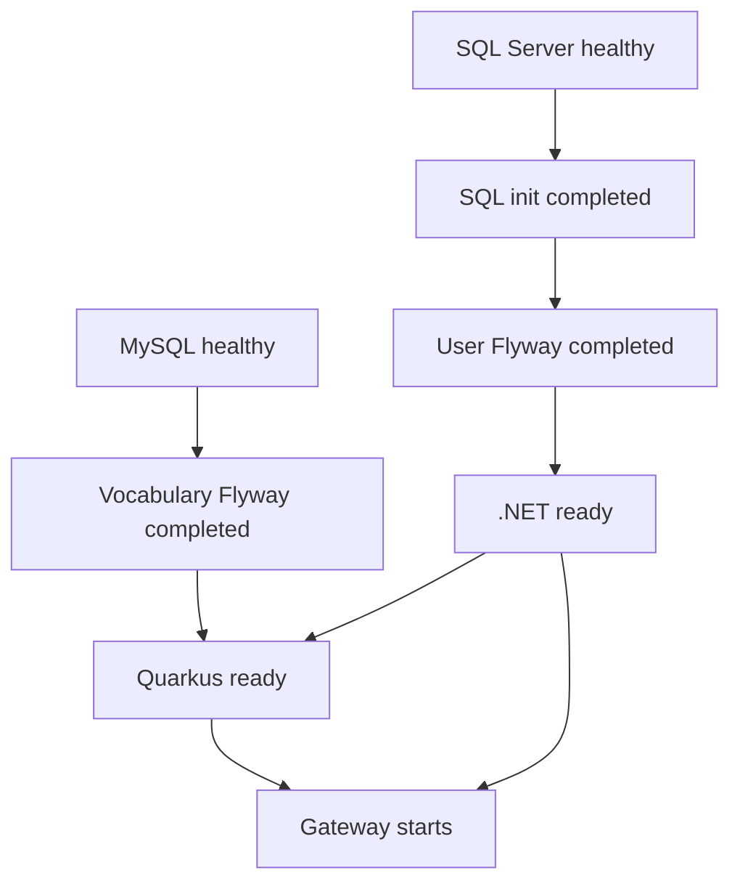

# Japanese Learning backend stack

Prerequisites: Docker with Linux containers and Docker Compose v2 or newer,
plus initialized Git submodules (`git submodule update --init --recursive`).
Application SDKs are not needed to build the images.

1. Copy `.env.example` to `.env` and set all three database passwords.
   Keep existing passwords when reusing database volumes; changing `.env`
   does not change stored database credentials. Follow the quoting notes in
   `.env.example`.
2. Provide a matching RSA PEM pair (at least 2048 bits, unencrypted private key):
   `secrets/jwt/private.pem` and `secrets/jwt/public.pem`.
   Alternatively run `pwsh -File ./scripts/generate-jwt-keys.ps1` (requires
   PowerShell and the .NET 9 SDK; refuses to overwrite existing keys).
   Both files must be readable by the .NET container user, UID 1654, with
   directory traversal permission. They are mounted read-only only into .NET.
   `.env` and `secrets/` are gitignored. Restart .NET after replacing keys.
3. Start from this directory:

   ```sh
   docker compose up --build
   ```

   Use `docker compose up --build -d` for detached mode, `docker compose ps -a`
   for status, and `docker compose logs user-api vocabulary-api` for app logs.

| Service | Host address | Container address |
| --- | --- | --- |
| MySQL (vocabulary only) | localhost:3306 | mysql:3306 |
| SQL Server (users only) | localhost:1433 | sqlserver:1433 |
| .NET User/Auth | http://localhost:8081 | http://user-api:8080 |
| Quarkus Vocabulary/Flashcard | http://localhost:8082 | http://vocabulary-api:8080 |

Readiness and public keys:

- .NET liveness: http://localhost:8081/health/live
- .NET SQL-backed readiness: http://localhost:8081/health/ready (`/health` remains an alias)
- Public JWKS: http://localhost:8081/.well-known/jwks.json
- Quarkus health: http://localhost:8082/q/health
- Quarkus liveness: http://localhost:8082/q/health/live
- Quarkus readiness: http://localhost:8082/q/health/ready

Database healthchecks execute authenticated SQL queries. MySQL must be healthy
before vocabulary Flyway runs. SQL Server must be healthy before the idempotent
`sqlserver-init` creates `JapaneseLearningUser` if absent, then user Flyway runs.
Each application waits for its database healthcheck and successful Flyway exit.
Flyway and the database initializer are one-shot containers with no automatic
restart; an exit code of 0 is expected. Migration failures block application startup.

Quarkus starts after .NET readiness passes and retains its 60-second initial
JWKS retry window. Both application Docker healthchecks use their readiness
endpoints through curl and discard response bodies. .NET installs curl in its
runtime image; Quarkus uses the runtime's existing curl.
Both applications retain their Dockerfile non-root users and share the default
Compose network. Quarkus obtains public keys only from
`http://user-api:8080/.well-known/jwks.json`. JWT issuer/audience values in `.env`
configure both services consistently. Authentication and role restrictions remain
enabled. Angular is not part of this stack.

Health and failure behavior:

- .NET `/health/live` performs no dependency I/O. `/health/ready` and `/health`
  open the configured application database connection, with a three-second check
  timeout. Responses contain only `Healthy` or `Unhealthy` (200 or 503).
  Required options and RSA keys must pass startup validation before HTTP serves.
- Quarkus `/q/health/live` is independent of MySQL and JWKS. `/q/health/ready`
  uses the built-in reactive MySQL check; `/q/health` aggregates checks and must
  not be used as liveness. Health JSON exposes only status and check names.
- JWKS is fetched at Quarkus initialization and cached. No health request calls
  Auth. During an Auth outage, valid tokens using cached keys can still work;
  unknown keys requiring refresh cannot be verified while JWKS is unavailable.
- SQL/MySQL outages fail the respective readiness probe while application
  liveness remains healthy. Recovery is detected by subsequent probes.
- Compose gates initial startup on health and successful one-shot completion.
  It does not continuously gate traffic or stop dependents after an outage.
  `restart: unless-stopped` restarts exited processes, not unhealthy containers.
  Application probes retain 12 consecutive failures before Docker marks them
  unhealthy. Endpoint readiness can fail earlier. Curl stops waiting after five
  seconds; the built-in Quarkus datasource check can take up to 20 seconds during
  connection failure. These probe deadlines do not change application liveness.
- NGINX stays alive during backend outages; affected proxied requests can return
  502 (connection failure) or 504 (timeout). It does not aggregate backend health.
- Readiness checks connectivity, not migration history or every business query.
  Successful Flyway completion is the schema readiness gate. When manually
  running applications outside Compose, apply migrations first.

Startup dependencies (arrows mean the preceding condition must pass):



Quarkus requires both vocabulary Flyway completion and .NET readiness. Gateway
requires both backend readiness checks. Init/Flyway jobs have `restart: "no"`
and no healthcheck; failed jobs block new dependent application startup.

For safe fresh-volume checks, use a separate Compose project **and** override
fixed `container_name` entries and host ports. A project name alone is insufficient
because this file has fixed DB/Flyway names. Keep its volumes separate from normal
`mysql_data` and `sqlserver_data`; stop dependencies only in the disposable project.
Never print resolved Compose configuration containing passwords: use
`docker compose config --quiet` for validation.

Stop containers with `docker compose stop`, or remove containers and the network
with `docker compose down`. Database named volumes survive both operations.
`docker compose down -v` deletes those volumes and their database contents;
do not use it unless intentionally resetting all local data.

---

## API Gateway

NGINX (official `nginx:stable-alpine`) is the client-facing backend entry point:
**http://localhost:8080** (host 8080 to container 8080). Start it with the same
`docker compose up --build -d` command. Direct ports 8081/8082 remain available
for backend debugging; clients should use the Gateway.

| Gateway path | Owner / internal upstream |
| --- | --- |
| `/api/auth` and descendants | .NET, `user-api:8080` |
| `/api/v1/flashcards` and descendants | Quarkus, `vocabulary-api:8080` |
| `/api/v1/jlpt-levels` and descendants | Quarkus, `vocabulary-api:8080` |
| `/api/v1/lessons` and descendants | Quarkus, `vocabulary-api:8080` |
| `/api/vocabularies` and descendants (including import) | Quarkus, `vocabulary-api:8080` |
| `/health` | Static Gateway process health (200) |
| Other paths | 404 |

Paths, query parameters, and Authorization are preserved. NGINX forwards Host,
X-Real-IP, X-Forwarded-For, and X-Forwarded-Proto; as the edge proxy it replaces
client-supplied forwarding headers. Backends retain their current proxy-trust
settings. Uploads are capped at 10 MiB. Access logs use fixed route families,
status/upstream status, timing, and correlation IDs; they omit arbitrary URLs,
request bodies, and credential headers. Raw per-request NGINX error logging is
disabled because it can include request lines or headers; global startup and
configuration errors still go to stderr.

.NET still issues and validates JWTs; Quarkus still validates RS256 and enforces
User/Admin access and Admin-only import. NGINX performs no JWT or role checks
and mounts no RSA keys. Quarkus continues to fetch JWKS directly from
`http://user-api:8080/.well-known/jwks.json`. Current clients do not need public
JWKS through the Gateway, so that path returns 404 there; the existing .NET
debug port still exposes public JWKS.

Gateway startup waits for both .NET and Quarkus readiness. Gateway `/health`
only proves NGINX can serve HTTP; it does not prove whole-system readiness.
Use the direct health URLs above to diagnose backends.
Docker DNS refresh handles upstream container IP changes without an NGINX restart.
Check configuration with `docker compose exec gateway nginx -t`.

Neither backend currently configures CORS. Step 6 leaves CORS unchanged.
For Step 7, prefer same-origin frontend/API hosting; if Angular runs on another
origin, configure an explicit origin allowlist and preflight handling once at
the Gateway, without duplicating policies in the services. Angular is unchanged.

## Logging and correlation IDs (Step 8.2)

NGINX and both services preserve a single `X-Correlation-ID` containing 1?64
ASCII letters, digits, underscores, or hyphens. Missing, empty, invalid,
overlong, and duplicate values are replaced with a random 32-character hex ID.
The gateway forwards its selected ID and returns exactly one response header,
including on error responses. Direct backend requests follow the same rules.
Angular needs no change: requests without a header receive a generated ID.

.NET uses the ID as its existing `traceId` and includes `CorrelationId` in JSON
console logging scopes. Quarkus keeps its existing `meta.traceId` and
`meta.correlationId` contract; `X-Trace-Id` is also validated. Its HTTP filter
runs before authentication and uses Quarkus reactive MDC for application logs.
Request completion logs contain status, duration, and correlation context;
application error logs use exception types instead of potentially sensitive
exception messages. The .NET framework's duplicate raw exception dump is disabled.
No credential headers, request bodies, tokens, or configuration secrets are added
to these logs. IDs are diagnostic labels, not authentication or trusted identity.

After rebuilding the services and reloading NGINX, run
`python scripts/verify-correlation.py` against the local Compose ports. It checks
valid/missing/invalid/duplicate IDs, direct requests, gateway errors, a .NET
validation response, and matching gateway/backend request logs without credentials
or database writes. Backend test suites also cover error metadata, authentication
regressions, and concurrent asynchronous logging context.

## Gateway security hardening (Step 8.3)

All gateway responses, including API errors and `/health`, receive
`X-Content-Type-Options: nosniff`, `X-Frame-Options: DENY`,
`Referrer-Policy: no-referrer`, and `Cache-Control: no-store`. These protect API
responses and gateway error documents; the gateway does not host Angular HTML.
Conflicting upstream versions of these headers and `Expires` are hidden, as is
`X-Powered-By`. NGINX's version stays hidden with `server_tokens off`; the stock
image still identifies itself as `Server: nginx` and in generated error pages.

GET, HEAD, POST, PUT, PATCH, DELETE, and OPTIONS reach the existing routes.
Other methods receive 405 with an Allow header (some malformed requests, including
CONNECT, are rejected earlier by NGINX). Backend route-specific methods and
Authorization/JWT handling are unchanged. NGINX's parser rejects ambiguous body
framing and duplicate Host headers; invalid/underscore header names are ignored.
Client-supplied Forwarded, X-Forwarded-Host/Port, Proxy, Upgrade, TE, and Trailer
headers are removed. Host (including the dev port), Authorization, and the selected
correlation ID are preserved; edge IP/protocol headers are overwritten as before.

Limits are 10 MiB per body and four 8 KiB large header buffers (each individual
header/request line must fit one buffer). Header reading has a 10-second deadline;
body reads, response writes, and idle keep-alive use 30 seconds. Upstream connection
timeout is 5 seconds; upstream send/read inactivity remains 60 seconds so the
existing import window is preserved. These are mostly inactivity limits, not a
total request deadline. Request buffering stays enabled, proxy caching stays off,
and upstream retries are disabled to avoid replaying auth/import operations.

Run `python scripts/verify-gateway-security.py --live` after validating and reloading
NGINX (`docker compose exec gateway nginx -t`, then `nginx -s reload` through the
same command). The script uses the exact gateway config with disposable isolated
NGINX upstreams to check forwarding, conflicting headers, malformed requests,
limits, timeout, and log redaction. It then checks the local Compose routes,
missing/invalid-token rejection, OPTIONS parity, and the Step 8.2 regression.
No real credentials, keys, or application records are needed. The isolated
containers/network are removed afterward. `docker compose config --quiet` validates
Compose without printing resolved secrets.

TLS/HSTS, frontend CSP/Permissions-Policy, CORS changes, WAF, and
backend security changes are intentionally absent. Angular's existing `/api` dev
proxy remains compatible. Direct backend/database ports are still development
exposures that bypass gateway controls; restrict them when deploying. HTTP provides
no transport confidentiality. Raw request error diagnostics are deliberately lost
in favor of sanitized access logs; body/upstream timeout behavior and an Angular
browser session are not covered by the smoke script.

## Gateway rate limiting and basic abuse protection (Step 8.4)

The gateway layers endpoint-specific budgets on a general per-client-IP budget.
The client identity is the TCP peer (`$binary_remote_addr`), never a forwarded IP,
JWT, correlation ID, query string, or user-supplied account name. Normalized paths
and case-insensitive sensitive-route matching cover ASP.NET's route variants.
Login and registration share one budget; refresh and import have separate budgets.
Successful and unsuccessful attempts both count, without inspecting credentials.

| Proxied requests | Sustained rate per IP | Immediate burst allowance |
| --- | --- | --- |
| All API traffic except OPTIONS | 20/second | 40 excess requests |
| Login + registration combined | 10/minute | 5 excess requests |
| Token refresh | 60/minute | 10 excess requests |
| Vocabulary import | 2/minute | 1 excess request |

NGINX uses leaky buckets, not fixed minute windows. From an idle bucket the first
request plus the burst allowance can pass immediately; excess requests return
HTTP **429**. `nodelay` avoids keeping a queue of delayed requests. Budgets refill
continuously: roughly one slot per 6 seconds for login/registration, 1 second for
refresh, 30 seconds for imports, and 50 ms for ordinary API requests. Clients should
back off after 429 rather than retry immediately; another client sharing their IP
can consume recovered capacity. Standard NGINX error bodies retain all Step 8.3
security headers and the selected `X-Correlation-ID`.

Active proxied requests are also capped at **20 per IP**, **200 across this gateway**,
and **2 concurrent imports across this gateway**. The shared counters cover all
workers. Requests count after their full headers arrive, including requests waiting
for a body or upstream. Slots are released when requests finish/disconnect.
OPTIONS bypasses rate and import-specific budgets but still obeys the broad active
request caps; its backend routing/authentication behavior is unchanged. `/health`
is exempt from every new limiter and stays a cheap static response. Local 404 and
method rejections remain fast returns without consuming upstream budgets.

All zones and limits are in `gateway/nginx.conf`; shared memory is bounded (52 MiB
configured across request and connection zones). Keep `limit_req` and `limit_conn`
directives together at server scope: child-level directives replace inheritance
for that directive family. Safe access logs include rate/connection admission
outcomes, with no credential data. Existing timeouts and buffer/body limits remain.

Verify with `python -B scripts/verify-gateway-rate-limits.py`, followed by
`python scripts/verify-gateway-security.py --live` against the reloaded local stack.
The isolated rate test uses the exact gateway configuration, synthetic NGINX
upstreams, and a disposable `python:3.14-alpine` test client. It checks every real
burst/refill interval, independent source IPs, spoof resistance, all three active
request caps and recovery, health/OPTIONS behavior, and headers on 429 responses.
It holds at most 200 synthetic incomplete bodies, writes no application data, and
removes its test containers/network. Existing live smoke tests are paced below
the general rate instead of bypassing the limiter. Validate Compose with
`docker compose config --quiet` to avoid printing resolved credentials.

These are initial limits for this architecture, not load-tested capacity figures.
Shared NATs (including Docker/Angular dev proxies) share budgets. State is local
to one gateway instance, survives a normal config reload, and resets on restart;
multiple replicas do not share counters. Published backend ports still bypass
these controls. Partial-header/idle connections are governed by the existing
worker and timeout bounds rather than `limit_conn`. This is application-level
abuse protection, not protection against network saturation or a distributed
botnet. No WAF/CDN, Redis, CAPTCHA, account lockout, backend limits, TLS, or telemetry
has been added. A future trusted upstream proxy requires deliberate real-IP trust
configuration; do not simply trust client-supplied forwarding headers.

## Production API errors (Step 8.5)

Both backends reuse their existing `success: false` / `error` envelope. Errors have
`code`, a safe `message`, and optional validation `details`. The .NET response
keeps `traceId` equal to `X-Correlation-ID`; Quarkus keeps its existing
`meta.timestamp`, `meta.traceId`, and `meta.correlationId`. Error responses carry
the same sanitized `X-Correlation-ID` as request logs, including rejected tokens.

Validation/binding failures return 400 (existing Quarkus query-conversion 404s are
preserved), authentication 401, authorization 403, missing resources 404, business
conflicts 409, and unexpected failures 500. Explicit framework statuses such as
405, 413, 415, and 503 remain intact. Existing business codes/messages remain;
framework messages are replaced with fixed text. MVC/framework validation does
not echo submitted values. Invalid vocabulary JSON/data and missing upload files
return 400; file-system or persistence failures remain server errors.

Authentication decisions and bearer challenges remain unchanged; .NET omits
challenge diagnostic details. Quarkus proactive authentication stays enabled and
its failure response customization is non-blocking. Unexpected exceptions are
logged once with bounded exception types/code locations and request IDs, without
exception messages, source paths, payloads, or credentials. Expected business and
validation failures use normal completion logs rather than error-level dumps.
Business error messages and future validator messages must stay safe for clients.

Gateway-generated errors and health responses keep their existing formats. The
API contract cannot replace transport errors that occur before application
middleware or responses that have already started. No Gateway or Angular runtime
changes are required.

Verify with `dotnet test dotnet/JapaneseLearning.User.sln --configuration Release`,
`quarkus/mvnw.cmd -f quarkus/pom.xml verify`, and
`python -B scripts/verify-correlation.py` against rebuilt local containers.
The Quarkus suite has two existing fixture failures in `VocabularyFileReaderTest`
and `VocabularyImportValidatorTest`; these are unrelated to error handling.

## Container hardening (Step 8.6)

All eight Compose services run as non-root with a read-only root filesystem,
`no-new-privileges`, an init process, disabled kernel core dumps, and explicit
CPU, memory (including swap), and process limits. All Linux capabilities are
removed except `NET_BIND_SERVICE` on SQL Server: the pinned vendor executable
has `cap_net_bind_service=ep`, so removing it from the bounding set causes
`exec` to fail with `Operation not permitted`. No root, privileged mode, or
`SYS_PTRACE` exception is needed. See the Linux
[capability execution rules](https://man7.org/linux/man-pages/man7/capabilities.7.html).

| Service | Memory ceiling | CPUs | Process/thread ceiling |
| --- | --- | --- | --- |
| Gateway | 256 MiB | 1 | 128 |
| .NET API | 512 MiB | 2 | 256 |
| Quarkus API | 1 GiB | 2 | 256 |
| MySQL | 1 GiB | 2 | 256 |
| SQL Server | 3 GiB | 2 | 512 |
| Each Flyway job | 512 MiB | 1 | 128 |
| SQL initializer | 256 MiB | 1 | 64 |

These are initial development-stack budgets, not measured production capacity.
SQL Server's internal memory budget is 2048 MiB, leaving container headroom.
Tmpfs usage counts against container memory. Tune budgets together under real load.

The existing database named volumes remain writable and unchanged. MySQL uses
its image UID/GID 999 directly; existing volumes must already be owned accordingly.
SQL Server retains its image user. No automatic recursive ownership changes are
performed. Temporary paths are explicit, bounded tmpfs mounts: gateway PID/body
buffers, MySQL sockets, API/framework temporary files, and Java working files.
JVM tmpfs mounts allow native-library mappings; other temporary mounts are
`noexec`. All use `nosuid,nodev`. The .NET Data Protection directory remains
transient as it was on container recreation; JWT signing still uses the existing
read-only PEM mounts and does not depend on those framework keys.

NGINX now runs entirely as UID 101 on container port 8080; the host gateway URL
stays `http://localhost:8080`. Its mounted configuration bypasses image startup
scripts, with logs on stdout/stderr. Database and direct-backend published ports
bind only to `127.0.0.1`, retaining local tools and Angular development access.
The gateway remains the externally exposed entry point. Network segmentation,
secret delivery, database-account privilege changes, and TLS are outside this step.

Graceful-stop budgets are 75 seconds for NGINX (SIGQUIT, workers bounded to 65s),
45s for APIs (Quarkus drains for up to 20s), 60s for databases, and 30s for jobs.
SQL Server executes directly so stop signals reach the server; database creation
continues through the separate initializer and Flyway jobs. Long-running services
keep `unless-stopped`; completed jobs keep `restart: no`. Image bases and vendor
services are pinned to the inspected digests. Refresh these deliberately for
security updates; pinning is not vulnerability scanning. Quarkus application files
are root-owned and readable, but not writable, by its runtime user.

Verification (build first with `docker compose build`):

- `python -B scripts/verify-container-hardening.py --fresh` starts a separate stack
  with generated DB credentials, no fixed names/ports, and tmpfs databases. It
  exercises first initialization, migrations, real register/login/refresh, JWKS,
  authorization, and API recreation. It creates/deletes no Docker volumes and
  does not change existing application data; it does reuse read-only JWT binds.
- `python -B scripts/verify-container-hardening.py` checks the running stack's
  actual restrictions, health, and completed jobs.
- Use `--snapshot <temporary-file>` before and `--compare <temporary-file>` after
  recreating the existing DB containers to compare volume identities and aggregate
  fingerprints of account/token and selected vocabulary tables. No row data or
  credentials are saved. Concurrent application writes can invalidate comparison.
- `python -B scripts/verify-gateway-security.py --live` and
  `python -B scripts/verify-gateway-rate-limits.py` exercise the gateway with its
  actual Compose runtime restrictions, including correlation and limiter recovery.

Never use volume deletion to resolve permission failures. On other hosts, verify
bind permissions and UID ownership before starting; Docker Desktop verification
does not establish compatibility with every rootless engine or host filesystem.

# GIT SUBMODULE CHEAT SHEET

## Clone Repository + All Submodules

    git clone --recurse-submodules <REPOSITORY-URL>

## Initialize Submodules After Cloning

    git submodule update --init --recursive

## Check Submodule Status

    git submodule status

## Update All Submodules

    git submodule update --remote

## Update a Specific Submodule

    git submodule update --remote <SUBMODULE>

## Work in a Submodule

    cd <SUBMODULE>

    git switch <BRANCH>

    git pull

## Create a Feature Branch

    git switch -c feature/<FEATURE-NAME>

## Push a Branch for the First Time

    git push -u origin <BRANCH>

## Commit and Push Changes

    git add .
    git commit -m "<COMMIT-MESSAGE>"
    git push

## Return to Root Repository

    cd ..

## Update Root Repository with Submodule Changes

    git status
    git add <SUBMODULE>
    git commit -m "chore: update <SUBMODULE> submodule"
    git push

## Recreate a Local Branch from Remote

    git fetch origin
    git switch -c <BRANCH> --track origin/<BRANCH>
## Configuration and secrets

`.env.example` contains blank password placeholders and non-sensitive defaults.
Supply all three DB passwords locally; never paste resolved `docker compose config`,
container environments, or private key contents into logs/issues. Use
`docker compose config --quiet` to validate without printing credentials.
Compose environment values remain visible to Docker administrators; protect host
access and `.env` with owner-only permissions. Git ignore rules are a guard against
accidental additions, not protection against `git add -f` or secrets pasted into code.

The pinned MySQL initializer does not escape SQL password literals or its client
option file. A small Compose entrypoint guard rejects quotes, backslashes, control
characters and blank MySQL passwords before initialization, with setting names only
in errors. MySQL database/user names use 1-64 ASCII letters/digits/underscores/hyphens.
This restriction does not apply to SQL Server passwords. Keep existing volume
credentials; do not change passwords in `.env` as a substitute for database rotation.

Compose passes .NET database server/name/user/password separately. SqlClient builds
and escapes the connection string, including passwords containing quotes or semicolons.
For standalone .NET development use `Database__ConnectionString` **or** the four
`Database__Server`, `Database__Name`, `Database__User`, `Database__Password` settings;
do not mix both forms. `Database__TrustServerCertificate=true` retains the current
local SQL Server behavior. No passwords belong in appsettings files.
Quarkus uses `DB_USERNAME`, `DB_PASSWORD`, and a credential-free
`DB_REACTIVE_URL=mysql://host:port/database`. `AUTH_SERVER_URL` and `AUTH_JWKS_URL`
accept HTTP/HTTPS URLs without user information, queries, or fragments; credentials
must never be embedded in URLs. Existing localhost auth defaults remain available.

Both services validate required settings at startup without echoing rejected values.
.NET also validates connection-string syntax and RSA key pairs. JWT key IDs use
1-128 ASCII letters/digits/hyphens/underscores; issuer/audience values are bounded to
256 characters without control characters. Access lifetime is 1-1440 minutes;
refresh lifetime is 1-365 days (`Jwt__RefreshTokenExpirationDays`, default 7).
The services must share issuer/audience values. Configuration validation does not
prove connectivity: authenticated readiness checks still verify databases.

The key generator uses exclusive file creation and a unique temporary build directory.
New private keys are owner-only on Unix (0600) and Windows (a protected owner ACL).
On Linux, grant only the container UID 1654 read access and directory traversal
before startup, using ownership or a narrow ACL; do not make private keys world-readable.
Generation never overwrites existing keys. Existing keys/permissions are not changed.
Back up signing keys securely; changing them invalidates existing access tokens.

Run `python -B scripts/verify-configuration.py` to audit tracked files and ignore
rules without printing secrets. After building images, add `--startup` to exercise
safe startup failures in disposable containers. Existing root verification scripts
cover gateway security, correlation, rate limits, and isolated full-stack auth flows.
The database accounts and existing volumes retain their current credentials;
credential rotation and provisioning less-privileged SQL Server accounts require
separate coordinated database administration.

## Local observability and metrics

Both APIs export Prometheus-format metrics on their existing backend listeners:
.NET at http://localhost:8081/metrics (Docker user-api:8080/metrics), and Quarkus
at http://localhost:8082/q/metrics (Docker vocabulary-api:8080/q/metrics).
These anonymous scrape endpoints are for the trusted Compose network and localhost
debugging only. The Gateway returns 404 for both paths. Keep backend ports bound to
localhost; this setup is not a public monitoring deployment. Existing health paths,
JWT/JWKS behavior, structured logs, and correlation IDs are unchanged.

.NET uses prometheus-net's HTTP middleware and process/GC collector in a dedicated
registry; arbitrary .NET Meters/EventCounters are not automatically exported.
Quarkus uses its Micrometer Prometheus extension, Vert.x HTTP instrumentation and
JVM/system binders. A filter permits only HTTP and runtime metrics. HTTP labels
contain fixed route groups, standard methods (others collapse to OTHER) and
bounded status codes. They contain no paths, query strings, identities, exception
messages, credentials or correlation IDs. Health and scrape traffic is excluded
from application HTTP metrics. Correlation IDs remain in logs, not metric labels
or HTTP exemplars. No tracing pipeline is installed.

| Metric family | Purpose |
| --- | --- |
| .NET http_requests_received_total, http_request_duration_seconds, http_requests_in_progress | Completed requests, status/error counts, latency buckets, active requests |
| Quarkus http_server_requests_seconds | Request/status counts and latency buckets |
| .NET process_*, dotnet_* | CPU, process/managed memory, threads, GC collections, start time |
| Quarkus jvm_*, process_*, system_* | Heap, GC, threads, uptime, CPU and runtime resource use |
| Prometheus up | Scrape availability; this is not database readiness |

To enable the optional local dashboard, set a strong GRAFANA_ADMIN_PASSWORD in
the ignored .env, then run:

    docker compose -f docker-compose.yml -f compose.observability.yml config --quiet
    docker compose -f docker-compose.yml -f compose.observability.yml up -d --build

Prometheus is at http://localhost:9090; Grafana is at http://localhost:3000
(username admin, password from .env). Grafana requires authentication and
has a provisioned **Japanese Learning APIs** dashboard in the **Japanese Learning**
folder. It shows scrape availability, request/4xx/5xx rates, p95 latency, memory,
CPU, GC and threads. Generate normal API traffic and allow at least two 15-second
scrapes for rate panels; empty error series mean no such events have been observed.

The overlay leaves the default development stack unchanged. Both new containers
are non-root, read-only apart from data volumes/tmpfs, drop capabilities and have
resource limits. Images are version/digest pinned. Scrapes have sample/label/size
limits; Prometheus retains two days or 512 MB of blocks, whichever limit is reached
(WAL/head data can use additional space). The prometheus_data and grafana_data volumes persist.
Changing the Grafana password environment variable does not rotate an already
initialized admin account; use Grafana's password-change workflow. Do not delete
volumes to change credentials. Grafana analytics and plugin preinstallation are disabled.

Run `python -B scripts/verify-observability.py` after starting the base stack with
the rebuilt images. It tests metric label safety, Gateway exclusion, and disposable
Prometheus/Grafana containers that scrape the running APIs. It uses generated
credentials and tmpfs data, queries every dashboard panel through authenticated
Grafana, and removes only its test containers/network. It never changes .env or
existing volumes. `verify-container-hardening.py --fresh` additionally verifies real
register/login/refresh/JWKS/role flows and checks their credentials/tokens against
both backend metrics and service logs.

References: [prometheus-net](https://github.com/prometheus-net/prometheus-net),
[Quarkus Micrometer](https://quarkus.io/guides/telemetry-micrometer/).
